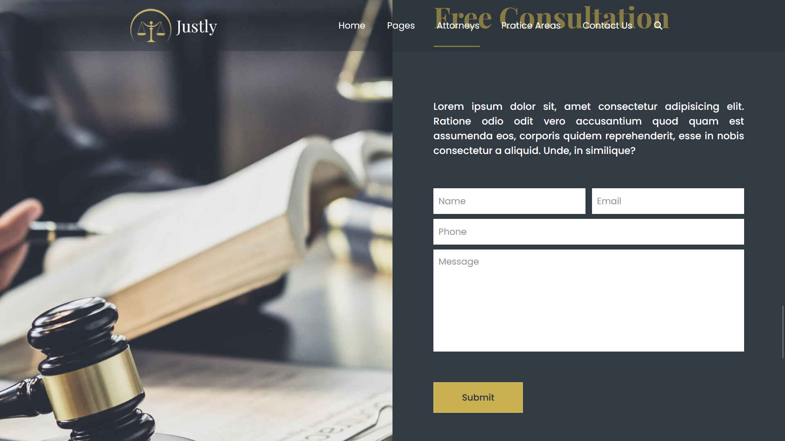

# Justly - Law Firm Agency Platform

Justly is a study project simulating an online platform for law firm agencies. The main objective is to allow users to browse and potentially hire a law firm agency. The website features information about the agency, client testimonials, a free consultation form, and a section showcasing posts about other cases.

## Visual Showcase

Below are some key views of the Justly website:

### Homepage Overview (Top to Bottom)

_(A GIF showing the scrolling of the main page from the top to the bottom.)_

### Overview

_(Screenshot of areas showcasing parts of the page.)_

### Free Consultation Form

_(Screenshot of the form to request a free consultation.)_

## Technologies Used

- HTML5
- CSS3

## Services Used

* **GitHub:** Used for code versioning, collaboration, and hosting the project repository.
* **Live Server (VS Code Extension):** Used to serve the static website locally during development, providing a quick way to preview changes without a full-fledged server setup.

## How to Run the Project

This project is a static website that can be viewed directly in your browser using the **Live Server** extension in VS Code:

1.  **Install the Live Server extension in VS Code:** If you don't have it already, search for "Live Server" in the VS Code extensions sidebar and click "Install."
2.  **Open the Justly project folder in VS Code.**
3.  **Open the `index.html` file.**
4.  **Right-click on the `index.html` file** within VS Code.
5.  **Select the "Open with Live Server" option.**

This will open the Justly website in your browser, and Live Server will automatically reload the page whenever you save changes to your HTML or CSS files.

## Main Features

* **Agency Information:** Presents details about the law firm agency (you can add generic or fictional information here for study purposes).
* **Client Testimonials:** A dedicated section to display comments and testimonials from clients (simulated).
* **Free Consultation Form:** A form where users can enter information to request a free consultation (actual submission functionality is not implemented in this study project).
* **Case Posts:** A section to showcase posts or articles about other cases (simulated content).

## Versioning

1.0.0.0

## Author

This "Justly" project was developed by Carlos Juatan as an educational project.

You can find more of my projects and contributions on my GitHub profile: https://github.com/Carlos-Juatan/

Feel free to explore the code and reach out if you have any questions or suggestions!

## License

This project is licensed under the MIT License. See the [MIT-License](https://github.com/Carlos-Juatan/spotifaz-react/blob/main/LICENSE) file for more information regarding the terms and conditions under which this software is licensed.